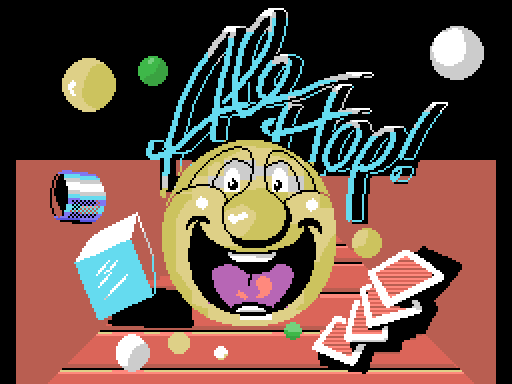
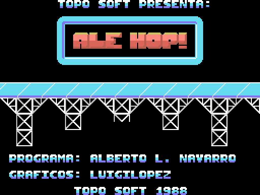

# Ale Hop! — desensamblado comentado

Código fuente Z80 completo y comentado de **Ale Hop!** (Topo Soft, MSX, 1988),
reconstruido a partir de la cinta original.

No es una aproximación ni una reimplementación: **los cuatro módulos vuelven a
ensamblar al binario original byte a byte**, y la cinta regenerada desde estos
fuentes es idéntica al TSX de partida, mismo sha256. Cada uno de los 42645 bytes
del bloque del juego está identificado: 4588 de código y 38057 de datos, cero
sin explicar.



## Lo que hay aquí

| | |
|---|---|
| `src/*.asm` | Los listados comentados. Se pueden leer sin compilar nada |
| `src/*.notes` | Los comentarios, anclados a dirección: sobreviven a un retrazado |
| `tools/` | Las herramientas: parser de cinta, trazador, generador de listados, arnés de emulador |
| `tests/` | 36 tests que comprueban contra el binario lo que afirma esta documentación |
| `docs/` | La explicación, con las pantallas del juego dibujadas desde los datos |

## Empezar

```sh
make            # extrae, traza, genera los listados y lo verifica todo
make imagenes   # dibuja los seis niveles desde los datos del juego
```

Hace falta `pasmo`, `z80dasm`, `python3` y, para la parte de emulador,
`openmsx`. La cinta `.tsx` **no** se distribuye.

Para leer sin ejecutar nada: [docs/es/EMPEZAR.md](docs/es/EMPEZAR.md).

## El juego

Una carrera de obstáculos: llevas una bola sonriente por seis pistas de scroll
horizontal, saltando lo que se te ponga por delante y con el tiempo en contra.
Los créditos, leídos del propio binario:

> **PROGRAMA:** ALBERTO L. NAVARRO · **GRÁFICOS:** LUIGILOPEZ · TOPO SOFT 1988



Y así es el nivel 1: el fondo con parallax arriba, la pista en medio y el
marcador abajo. Las tres bandas usan tercios distintos de la pantalla, cada uno
con su propio juego de patrones y de colores.


Más sobre cómo está montado: [docs/es/EL-JUEGO.md](docs/es/EL-JUEGO.md).

## Lo más interesante que salió

**El juego se carga encima de la ROM.** Los 42645 bytes entran en la página 0,
donde vive el BIOS del MSX, y luego el cargador mueve tres trozos a RAM alta. Los
35 KB de gráficos y mapas se quedan escondidos debajo de la ROM, y el juego solo
los destapa un instante cada vez que carga un nivel. Es la decisión que da forma
a todo lo demás: por eso el bloque del juego va partido en cinco listados y no
en uno (ocho ficheros `.asm` en total, contando los otros tres módulos de la
cinta).

**Hay un mensaje que casi nadie leyó.** Al superar el sexto nivel aparece un
texto que hace scroll, y la pantalla que lo enmarca está vacía: el texto se
escribe en marcha, letra a letra.


**Hay 135 bytes que no se ejecutan nunca**, y cuentan cosas: un efecto de color
a pantalla completa que se quedó fuera, el manejador de interrupción de la
librería de sonido sin usar, y un cargador de otra compilación con un mapa de
memoria distinto. Está todo en [docs/es/BYTES-MUERTOS.md](docs/es/BYTES-MUERTOS.md).

**Y hay sitio para dos niveles que no existen:** 1024 bytes de relleno justo
donde irían los fondos de los niveles 7 y 8.

Todos los hallazgos: [docs/es/HALLAZGOS.md](docs/es/HALLAZGOS.md).

## Cómo leerlo

- [Empezar](docs/es/EMPEZAR.md) — por dónde entrar, cómo reconstruirlo
- [El juego](docs/es/EL-JUEGO.md) — niveles, controles, cómo está montada la pantalla
- [La cinta](docs/es/LA-CINTA.md) — el formato TSX, el cargador turbo, la cadena de carga
- [El código](docs/es/EL-CODIGO.md) — la paginación, la rutina de frame, el sonido, los gráficos
- [Hallazgos](docs/es/HALLAZGOS.md) — lo que apareció al desmontarlo
- [Bytes muertos](docs/es/BYTES-MUERTOS.md) — los 135 bytes que no se ejecutan

## Aviso

Esto es trabajo de documentación y preservación sobre un juego de 1988. El
código y los gráficos son de sus autores y de Topo Soft. La cinta no se
distribuye. Ver [AVISO-LEGAL.md](AVISO-LEGAL.md).
