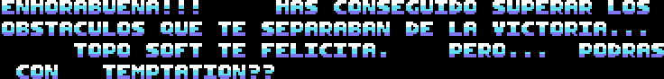
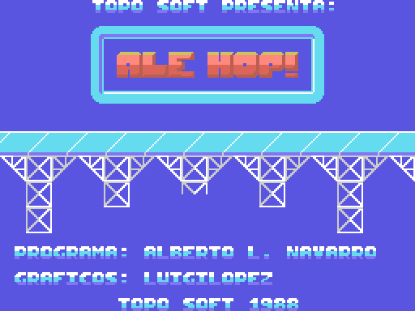

# Findings

What turned up while taking the game apart, roughly most to least surprising.

## A message almost nobody got to read

Clear the sixth and last level and you get a screen with scrolling text:

> ENHORABUENA!!! HAS CONSEGUIDO SUPERAR LOS OBSTACULOS QUE TE SEPARABAN DE LA
> VICTORIA... TOPO SOFT TE FELICITA. PERO... **PODRAS CON TEMPTATION??**

("Congratulations!!! You've overcome the obstacles that stood between you and
victory... Topo Soft congratulates you. But... think you can handle
*Temptations*?")

The interesting part is how it's done. The screen framing it has two **empty**
boxes: the text isn't drawn anywhere. It sits in ASCII at 0xC3F0, and a routine
reads it letter by letter, pulls each glyph's bitmap back out of video memory
with a BIOS call, and shifts it one pixel per frame. A hand-rolled smooth
scroller.

The sign-off advertises another game Topo Soft had published the year before,
*Temptations* — which in turn ended by pointing at this one. They call out to
each other.

And you only see it by finishing the whole game, so not many people can have
read it in 1988.

## The game loads on top of the ROM

A 64 KB MSX doesn't have 64 KB within reach: the bottom page, 0x0000 to 0x3FFF,
is occupied by the BIOS ROM, and the RAM underneath is covered. The usual move
for a tape game is not to bother and load from 0x4000 up.

*Ale Hop!* does the opposite. It puts the 42645-byte block **into page 0**, on
top of where the BIOS lives, then moves three chunks up into high RAM and covers
what's left with the ROM again.

So the 35 KB of graphics and maps spend nearly all their time **hidden under the
BIOS**. The game only uncovers them for an instant each time it loads a level,
between a `call 0xF00F` and a `call 0xF000`, copies what it needs and covers
them back up. That way it can keep calling the BIOS normally the rest of the
time.

It's the decision that shapes everything else, including why this disassembly is
five listings instead of one.

## There's room for two levels that don't exist

Background maps are located with `0x3000 + level * 0x200`. There's space for
eight, but only six have data: the 1024 bytes that levels 7 and 8 would occupy
are **0xFF filler**, and the loader stops at the sixth with a
`cp 6 / jp z,0xC000`.

## 135 bytes that never execute

Four stretches of perfectly coherent Z80 that no path reaches. Among them, a
**full-screen colour effect** that turns every black into transparent — 3673 of
the screen's 6144 colour bytes — and which only makes sense paired with a change
of backdrop colour. Half a fade that got left out.

The full story of all four is in [DEAD-BYTES.md](DEAD-BYTES.md).

## Parallax in one instruction

The background moves four times slower than the track, and the trick is
disarmingly simple. Both blit routines read the same variable — the camera
column — but the background's does an `and 0x3F` on it and its map is 64 columns
wide, while the track's uses the whole byte over a 256-column map. That's all.
Depth at zero cost.

## A multicolour sprite on a machine without them

The MSX1 allows one colour per sprite. The main character is drawn by stacking
**three sprites** at the same position, one per colour — black, white and light
yellow — rebuilt every frame. The bouncing ball on the title screen does exactly
the same.

## The sound engine came from outside

The music player doesn't look like it was written for this game so much as
dropped into it as a library. The evidence is in the binary itself: it brings
**its own interrupt handler**, ready to hook into the system — and the game
doesn't use it, because it has its own. It just sits there, 21 bytes nobody
executes.

## The credits

The title screen, reconstructed by decompressing the graphics and assembling the
map, reads:

> **PROGRAMA:** ALBERTO L. NAVARRO · **GRÁFICOS:** LUIGILOPEZ · TOPO SOFT 1988

That's read out of the binary, not from external sources. It's what the game
itself claims.
