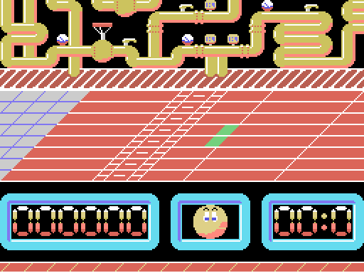
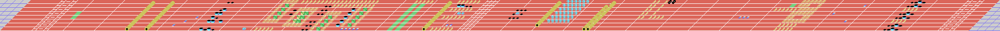

# The game

*Ale Hop!* is an **obstacle race**. You steer a grinning ball down six
horizontally scrolling tracks, jumping whatever gets in the way and picking
things up, with the clock against you.



The credits come from the game's own title screen, reconstructed by
decompressing the graphics out of the binary:

> **PROGRAMA:** ALBERTO L. NAVARRO
> **GRÁFICOS:** LUIGILOPEZ
> TOPO SOFT 1988

## How the screen is put together

The three horizontal bands aren't a design flourish — they're the three the MSX
**SCREEN 2** mode hands you. That mode splits the display into three eight-row
thirds and gives each its own pattern and colour tables, which is how you get
768 distinct tiles on screen instead of 256.

| rows | what goes there | source |
|---|---|---|
| 0-7 | The background, repeating four times | 64x8 map at `0x3000 + level*0x200` |
| 8-15 | The playable track | 256x8 map at `level*0x800` |
| 16-23 | The scoreboard | fixed 32x8 map at `0x4500` |

## The background has no parallax, however much it looks like it

Both blit routines read the same variable — the camera column at 0xDB54 — but
the track's uses the whole byte, with its 256-column map, and the background's
does `and 0x3F` on it, with a 64-column one.

It is tempting to read a parallax into that, and this page used to. But **a mask
does not slow anything down**: the column goes up by one for both of them, so
the background advances at exactly the same rate as the track. What the
`and 0x3F` does is wrap it round at 64, so the same background **repeats four
times per level**. To go four times slower you would need a shift — two `rrca` —
not an `and`.

## The six levels

Each level is a 256-column strip of which you only ever see 32. Laid out whole,
this is level 1:



In each map byte, the **low 6 bits** say how the tile behaves and the **top 2**
pick which of four graphics banks it uses. That's why every level looks like a
different game even though the engine is identical: the bank changes, the code
doesn't.

There are 15 terrain classes, derived by comparing the low 6 bits against a
threshold table at 0xDACE:

```
0C 10 14 18 19 1A 20 22 24 26 28 32 38 3E FF
```

Nine of those classes have consequences. Some tiles stop you dead — the camera
snaps back 40 columns — others are collectibles worth 375 points that vanish
when touched, some add time, one grants an extra life up to a maximum of four,
and some kill you.

## The controls

- **Left and right** don't move you: they change your **speed**, which runs from
  0 to 38 and lives at 0xDB60. It's a racing game, not a platformer.
- **Up and down** move you diagonally across the track.
- **Space or fire** jumps.

Input goes through `GTSTCK`, checking the cursor keys first and then joystick 1,
so both work.

## The main character

The ball is a **multicolour sprite** on a machine that doesn't have them. The
MSX1 allows exactly one colour per sprite, so the game stacks **three sprites**
— one per colour: black, white and light yellow — at the same position. All
three are rebuilt every frame, reading their colours from 0xDB6E.

The bouncing ball on the title screen uses the same trick.

## The scoreboard

Seven score digits, the character's face, and a timer. The panel is a fixed map
blitted once when the stage starts; the digits are written on top of it.

## And if you finish it

Clear level 6 and you get a screen with a scrolling message:


> ENHORABUENA!!! HAS CONSEGUIDO SUPERAR LOS OBSTACULOS QUE TE SEPARABAN DE LA
> VICTORIA... TOPO SOFT TE FELICITA. PERO... **PODRAS CON TEMPTATION??**

("Congratulations!!! You've overcome the obstacles that stood between you and
victory... Topo Soft congratulates you. But... think you can handle
*Temptations*?")

The text isn't drawn into the screen: it's written at runtime, letter by letter,
by a smooth-scrolling routine. And the sign-off is an ad for another game Topo
Soft had released the year before.
